# tarea1-clon-web

## 📌 Descripción
Este proyecto consiste en la clonación del sitio web de Disney+ con fines educativos, replicando su estructura visual, estilos y distribución de elementos utilizando HTML y CSS puro.

---

## 🌐 Sitio original
El sitio tomado como referencia es:

https://www.disneyplus.com/es-cr?msockid=1e1601668e116592175317d98faf6486

---

## 👤 Autor
**Christopher Gabriel Duarte Barahona**  
Carnet: C12585  

---

## 🖼️ Comparación visual

### Sitio original

<p align="center">
  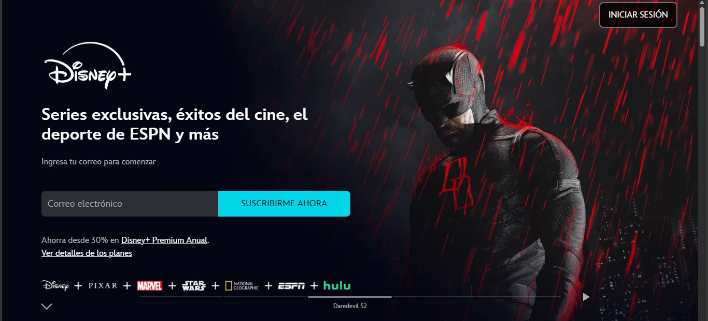<br>
  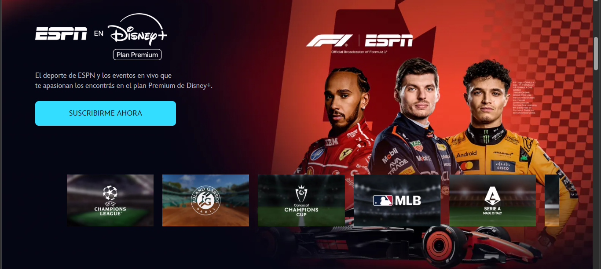<br>
  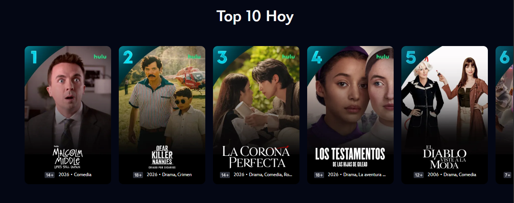<br>
  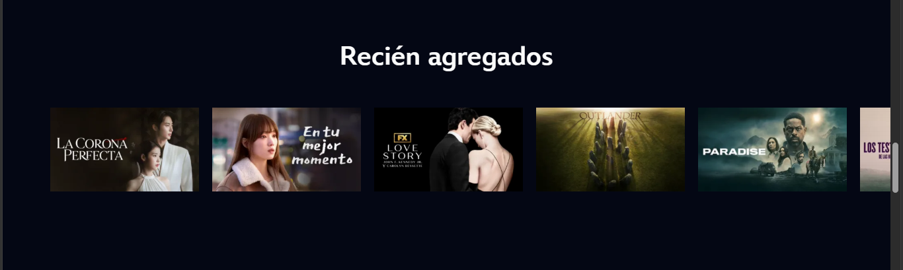<br>
  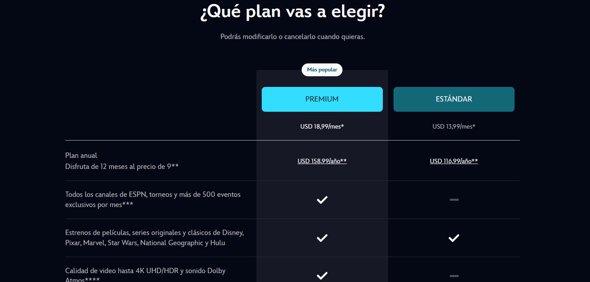<br>
  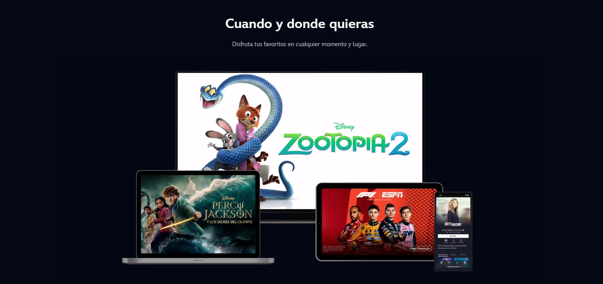<br>
  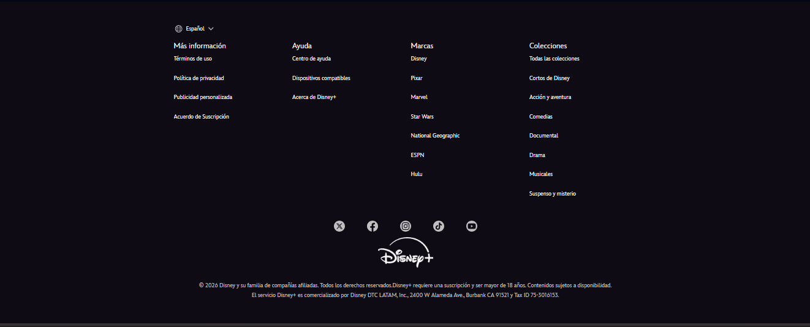
</p>

---

### Clon desarrollado

<p align="center">
  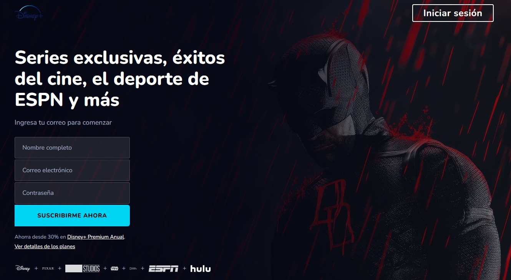<br>
  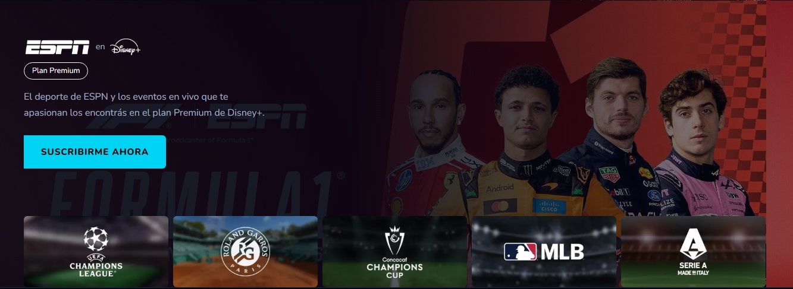<br>
  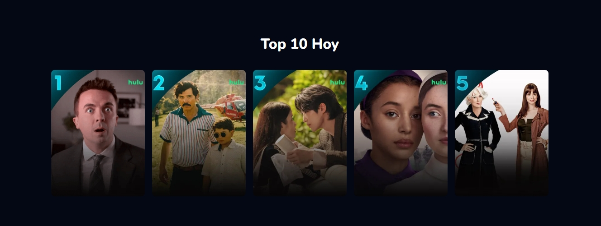<br>
  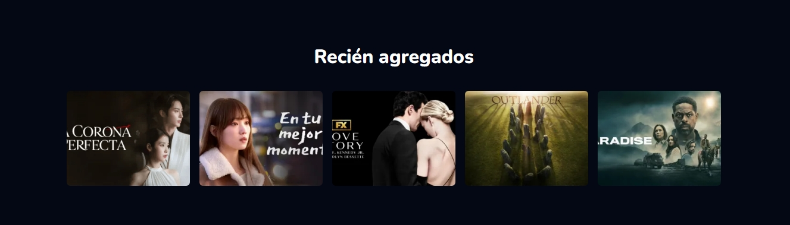<br>
  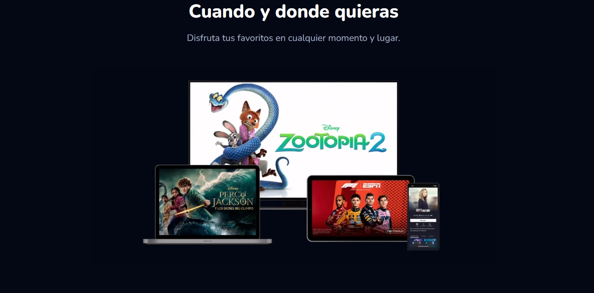<br>
  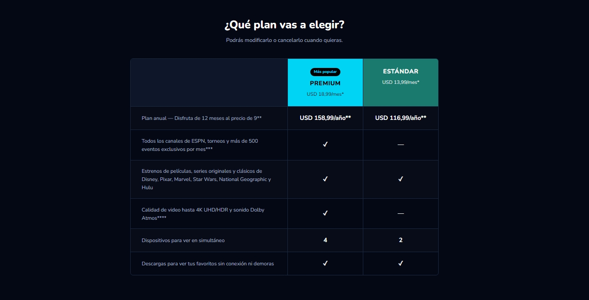<br>
  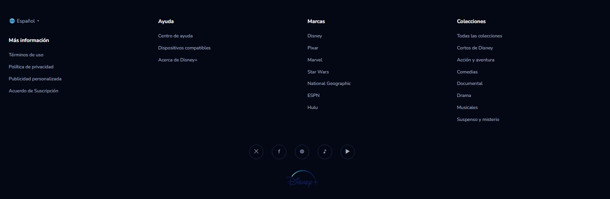
</p>

---

## ⚙️ Tecnologías utilizadas

- HTML5  
- CSS3  

---

## 🧠 Consideraciones de diseño

- Se intentó replicar fielmente la estructura visual del sitio original.
- Se respetaron proporciones, tipografías y distribución general.
- **Modificación importante:**  
  El formulario fue adaptado, ya que el original de Disney+ únicamente solicita el correo electrónico.  
  Para este proyecto se incluyeron campos adicionales, lo cual afecta ligeramente las dimensiones y distribución de la sección principal en comparación con el diseño original.

---

## 📁 Estructura del proyecto
```bash
/img
  Disney1.png
  Disney2.png
  ...
  Disneyclon7.png

index.html
styles.css